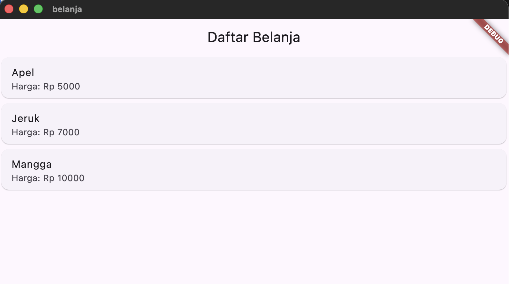

## Praktikum 1
```dart
import 'package:flutter/material.dart';

void main() => runApp(const MyApp());

class MyApp extends StatelessWidget {
  const MyApp({super.key});

  @override
  Widget build(BuildContext context) {
    Widget titleSection = Container(
      padding: const EdgeInsets.all(32),
      child: Row(
        children: [
          Expanded(
            // soal 1
            child: Column(
              crossAxisAlignment: CrossAxisAlignment.start,
              children: [
                // soal 2
                Container(
                  padding: const EdgeInsets.only(bottom: 8),
                  child: const Text(
                    'Wisata Gunung di Batu',
                    style: TextStyle(fontWeight: FontWeight.bold),
                  ),
                ),
                const Text(
                  'Batu, Malang, Indonesia',
                  style: TextStyle(color: Colors.grey),
                ),
              ],
            ),
          ),
          // soal 3
          const Icon(Icons.star, color: Colors.red),
          const Text('41'),
        ],
      ),
    );

    return MaterialApp(
      title: 'Flutter layout: Muhammad Rizal Al Baihaqi - 2341720225',
      home: Scaffold(
        appBar: AppBar(title: const Text('Flutter layout demo')),
        body: ListView(
          children: [
            Image.asset(
              'images/gunung.jpg',
              width: 600,
              height: 240,
              fit: BoxFit.cover,
            ),
            titleSection,
            const Padding(
              padding: EdgeInsets.all(32),
              child: Text(
                'Deskripsi',
                style: TextStyle(fontWeight: FontWeight.bold),
              ),
            ),
            const Padding(
              padding: EdgeInsets.symmetric(horizontal: 32),
              child: Text(
                'Wisata Gunung di Batu adalah salah satu destinasi wisata alam yang terletak di kota Batu, Malang, Indonesia. Wisata ini menyuguhkan pemandangan alam pegunungan yang indah serta udara yang sejuk dan segar. Banyak pengunjung yang datang untuk menikmati keindahan alam serta berfoto-foto di spot-spot yang telah disediakan.',
                softWrap: true,
              ),
            ),
          ],
        ),
      ),
    );
  }
}

```

## Praktikum 2
### Langkah 1
```dart
    Column _buildButtonColumn(Color color, IconData icon, String label) {
    return Column(
      mainAxisSize: MainAxisSize.min,
      mainAxisAlignment: MainAxisAlignment.center,
      children: [
        Icon(icon, color: color),
        Container(
          margin: const EdgeInsets.only(top: 8),
          child: Text(
            label,
            style: TextStyle(
              fontSize: 12,
              fontWeight: FontWeight.w400,
              color: color,
            ),
          ),
        ),
      ],
    );
  }
```
### Langkah 2 & 3
```dart
    Widget titleSection = Container(
      padding: const EdgeInsets.all(32),
      child: Row(
        children: [
          // ...existing code...
        ],
      ),
    );

    // Langkah 2: buttonSection
    Color color = Theme.of(context).primaryColor;

    Widget buttonSection = Row(
      mainAxisAlignment: MainAxisAlignment.spaceEvenly,
      children: [
        _buildButtonColumn(color, Icons.call, 'CALL'),
        _buildButtonColumn(color, Icons.near_me, 'ROUTE'),
        _buildButtonColumn(color, Icons.share, 'SHARE'),
      ],
    );
```

## Praktikum 3
### Langkah 1 & 2
```dart
Widget textSection = Container(
      padding: const EdgeInsets.all(32),
      child: const Text(
        'Carilah teks di internet yang sesuai '
        'dengan foto atau tempat wisata yang ingin '
        'Anda tampilkan. '
        'Tambahkan nama dan NIM Anda sebagai '
        'identitas hasil pekerjaan Anda. '
        'Selamat mengerjakan 🙂.',
        softWrap: true,
      ),
    );

    return MaterialApp(
      title: 'Flutter layout: Muhammad Rizal Al Baihaqi - 2341720225',
      home: Scaffold(
        appBar: AppBar(title: const Text('Flutter layout demo')),
        body: ListView(
          children: [
            Image.asset(
              'images/gunung.jpg',
              width: 600,
              height: 240,
              fit: BoxFit.cover,
            ),
            titleSection,
            buttonSection,
            textSection,
          ],
        ),
      ),
    );
```

## Praktikum 4
### Langkah 1
```dart
flutter:
  uses-material-design: true
  assets:
    - images/pantai.jpg
```
### Langkah 2 & 3
```dart
    return MaterialApp(
      title: 'Flutter layout: Muhammad Rizal Al Baihaqi - 2341720225',
      home: Scaffold(
        appBar: AppBar(title: const Text('Flutter layout demo')),
        body: ListView(
          children: [
            Image.asset(
              'images/pantai.jpg',
              width: 600,
              height: 240,
              fit: BoxFit.cover,
            ),
            titleSection,
            buttonSection,
            textSection,
          ],
        ),
      ),
    );
```


## Praktikum 5

.png)

## Tugas Praktikum 2
1. Inside the HomePage, I added the following line inside the onTap function of each product card:
  ```dart 
  Navigator.pushNamed(context, '/item', arguments: item);
  ```
2. In item_page.dart, I used this line inside the build() method to receive the data:
  ```dart
  final itemArgs = ModalRoute.of(context)!.settings.arguments as Item;
  ```
  After retrieving the data, I displayed it as follows:
  ```dart
  Text(itemArgs.name),
  Text('Price: Rp ${itemArgs.price}'),
  Text('Stock: ${itemArgs.stock}'),
  Text('Rating: ${itemArgs.rating}'),
  ```
3. In item.dart, I updated my model:
  ``` dart
    class Item {
    final String name;
    final int price;
    final String image;
    final int stock;
    final double rating;

    Item({
      required this.name,
      required this.price,
      required this.image,
      required this.stock,
      required this.rating,
    });
  }
  ```
  Then in HomePage, I created a list of sample iPhone products:
  ```dart
  final List<Item> items = [
      Item(
        name: 'Iphone 17 Air',
        price: 16500000,
        imagePath: 'assets/images/17air.jpg',
        stock: 25,
        rating: 4.4,
      ),
      Item(
        name: 'Iphone 17',
        price: 19000000,
        imagePath: 'assets/images/17.jpg',
        stock: 50,
        rating: 4.7,
      ),
      Item(
        name: 'Iphone 17 Pro',
        price: 24500000,
        imagePath: 'assets/images/17pro.jpg',
        stock: 30,
        rating: 4.9,
      ),
      Item(
        name: 'Iphone 17 Pro Max',
        price: 50000,
        imagePath: 'assets/images/17promax.jpg',
        stock: 10,
        rating: 4.5,
      ),
    ];
  ```
  I displayed these items in a GridView.builder:
  ```dart
      body: GridView.builder(
    padding: const EdgeInsets.all(10),
    gridDelegate: const SliverGridDelegateWithFixedCrossAxisCount(
      crossAxisCount: 2,
      crossAxisSpacing: 10,
      mainAxisSpacing: 10,
      childAspectRatio: 0.8,
    ),
    itemCount: items.length,
    itemBuilder: (context, index) {
      final item = items[index];
      return GestureDetector(
        onTap: () {
          Navigator.pushNamed(context, '/item', arguments: item);
        },
        child: Card(
          child: Column(
            children: [
              Image.asset(item.image, height: 120),
              Text(item.name),
              Text('Rp ${item.price}'),
              Text('Stock: ${item.stock}'),
              Row(
                mainAxisAlignment: MainAxisAlignment.center,
                children: [
                  const Icon(Icons.star, color: Colors.orange, size: 16),
                  Text(item.rating.toString()),
                ],
              ),
            ],
          ),
        ),
      );
    },
  ),
  ```
  This makes the product list appear like a real marketplace.

4. I added the Hero widget to both HomePage and ItemPage using the same tag (item.name).

In HomePage:
```dart
  Hero(
    tag: item.name,
    child: Image.asset(item.image, height: 120),
  ),
```
In ItemPage:
```dart
  Hero(
    tag: itemArgs.name,
    child: Image.asset(itemArgs.image, height: 200),
  ),
```
This creates a smooth zoom animation for the product image when navigating between pages.

5. I created a separate widget called Footer:
  ```dart
    class Footer extends StatelessWidget {
    const Footer({super.key});

    @override
    Widget build(BuildContext context) {
      return Container(
        padding: const EdgeInsets.all(12),
        color: Colors.transparent,
        child: const Center(
          child: Text(
            'Created by: Rizal Baihaqi (NIM: 2341720225)',
            style: TextStyle(color: Colors.black54),
          ),
        ),
      );
    }
  }
  ```
  Then I added it to the bottom of both HomePage and ItemPage:
  ```dart
  bottomNavigationBar: const Footer(),
  ```
6. I installed the plugin by adding this line to pubspec.yaml:
```dart
  dependencies:
  go_router: ^14.1.0
```


