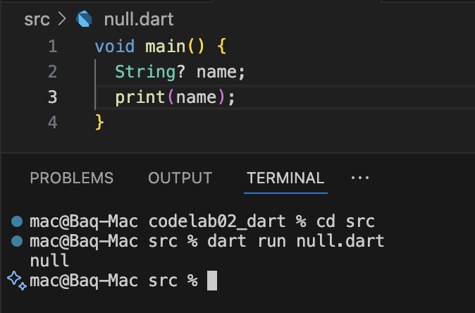

# Dart Practical Assignment

## Question 1
**Modify the code so the output matches your name:**

```dart
void main() {
  for (int i = 0; i < 5; i++) {
    print('Hello Rizal ${i + 1}');
  }
}
```

**Output:**


---

## Question 2
**Why is it important to understand Dart before Flutter?**

It is important to learn Dart first because Flutter uses Dart as its main programming language. If we don’t know Dart, it will be hard to understand how Flutter works. By knowing Dart basics like variables, loops, and functions, we can write Flutter code easier and fix errors faster. In short, Dart is the foundation, and Flutter is built on top of it.
---

## Question 3
**Summary of Dart Material:**

From the codelab material, several key points can be summarized to support mobile application development using Flutter. First, the environment setup is essential, which involves installing the Flutter SDK, IDE, and emulator. Next, developers must understand the project structure, especially the main.dart file which serves as the entry point of every Flutter app. Flutter uses a widget-based system where everything on the screen is represented as a widget, either stateless or stateful. One of Flutter’s strengths is hot reload, which allows developers to see changes instantly without restarting the app. Understanding state management is also crucial since it controls how data flows in the application. Flutter provides both Material Design and Cupertino widgets to support Android and iOS interfaces. In addition, developers should learn about navigation between pages, using external packages from Pub.dev, and applying testing and debugging techniques. All of these points together form the foundation for building strong and efficient mobile applications with Flutter.
---

## Question 4
**Difference between Null Safety and Late Variable**

### Null Safety
- By default, variables **cannot be null** unless marked with `?`.  
- Example:



### Late Variable
- A variable will be assigned **later**, but must have a value before being used.  
- Useful when a variable’s value will be set afterward.  
- Example:


**Difference:**
- **Null Safety (`?`)** → the variable can be empty (null).  
- **Late** → the variable cannot be null, but it is initialized later.  