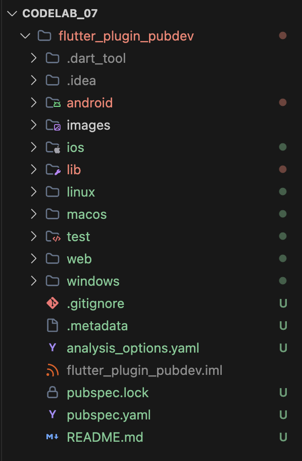
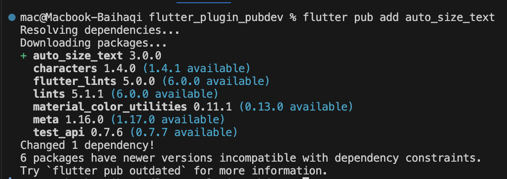
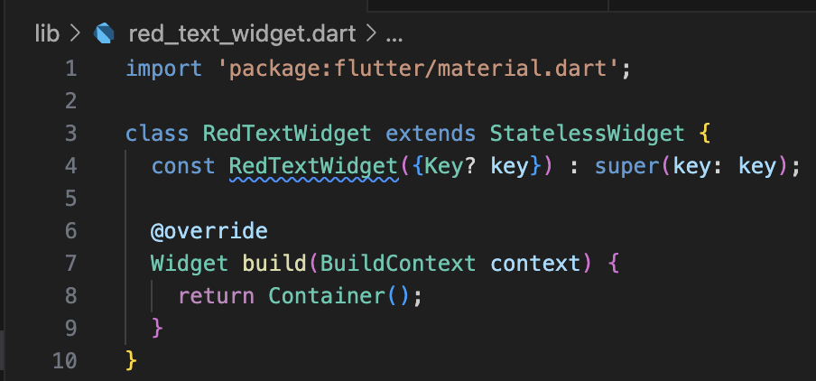
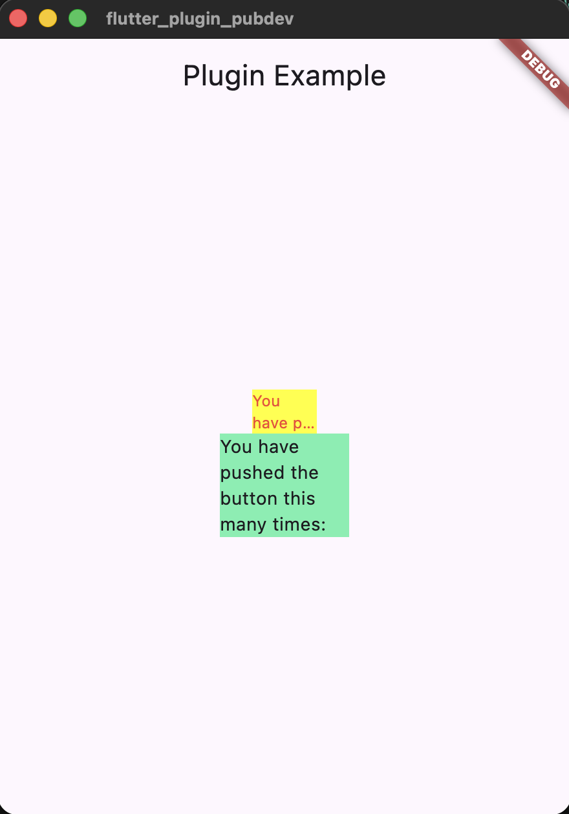

# Praktikum Menerapkan Plugin di Project Flutter
## Langkah 1

## Langkah 2

## Langkah 3

## Langkah 4
It shows error because The plugin hasn’t been imported yet.
The AutoSizeText widget comes from the auto_size_text package, so it must be imported:
```dart
import 'package:auto_size_text/auto_size_text.dart';
```
and the "text" Variable didnt defined yet.
## Langkah 5
```dart
final String text;
const RedTextWidget({Key? key, required this.text}) : super(key: key);
```
After we add this code the error dissapperaed.
## Langkah 6
```dart
Container(
   color: Colors.yellowAccent,
   width: 50,
   child: const RedTextWidget(
             text: 'You have pushed the button this many times:',
          ),
),
Container(
    color: Colors.greenAccent,
    width: 100,
    child: const Text(
           'You have pushed the button this many times:',
          ),
),
```
after we add that it'll shows
