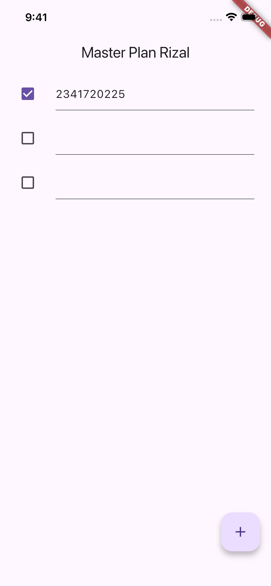

# Praktikum 1
1. Explain the purpose of Step 4 in the practicum! Why is it done that way?
```dart
export 'plan.dart';
export 'task.dart';
```
This step is done to bundle all model exports into a single file.
That way, instead of importing each model separately, other files can simply import one file

2. Why is the plan variable needed in Step 6? Why is it declared as a constant?

The plan variable acts as the main state holder that stores the plan’s name and its list of tasks.
Because this practicum uses StatefulWidget, we need a variable to manage and update the data when the UI changes.

3.  Capture the result of Step 9 as a GIF and explain what you created!


Step 9 demonstrates how Flutter handles state management using setState() to dynamically update the view when the data changes.

4. What is the purpose of the methods in Step 11 and 13 within the lifecycle state?

- Step 11 – **initState()**
This method is called once when the widget is first created.
Here, it’s used to initialize the ScrollController and add a listener that removes focus from text fields when the user scrolls — preventing keyboard overlap issues on iOS.

- Step 13 – **dispose()**
This method is called when the widget is removed from the widget tree.
It’s used to release resources such as controllers to avoid memory leaks.