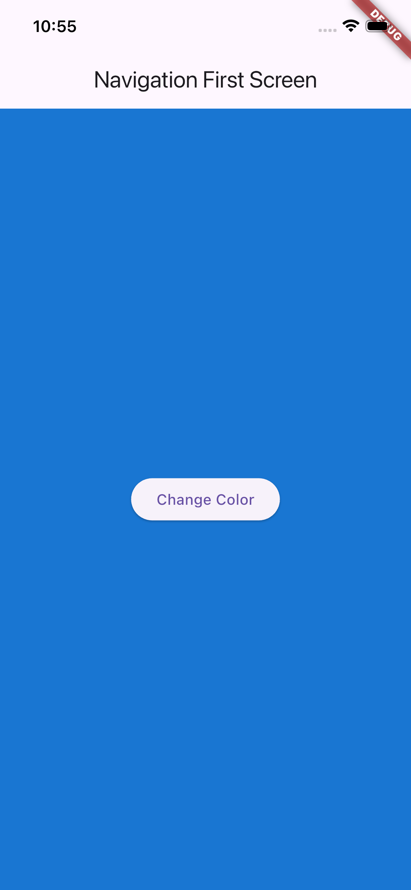
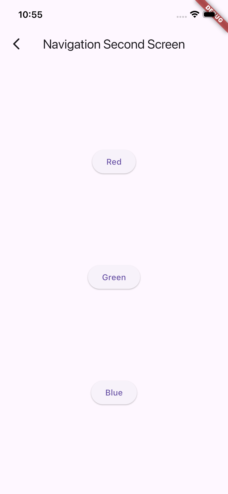
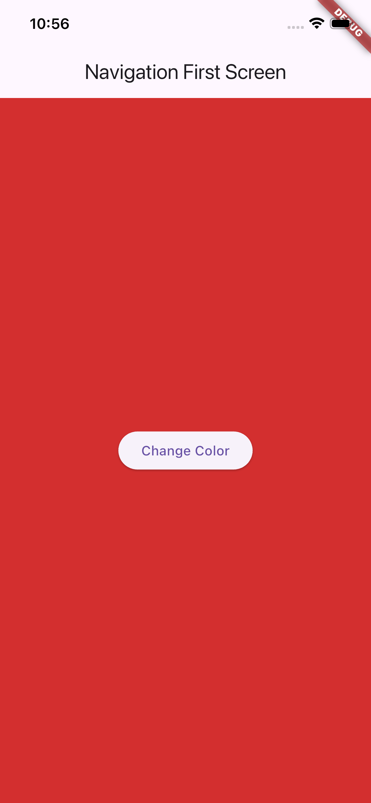
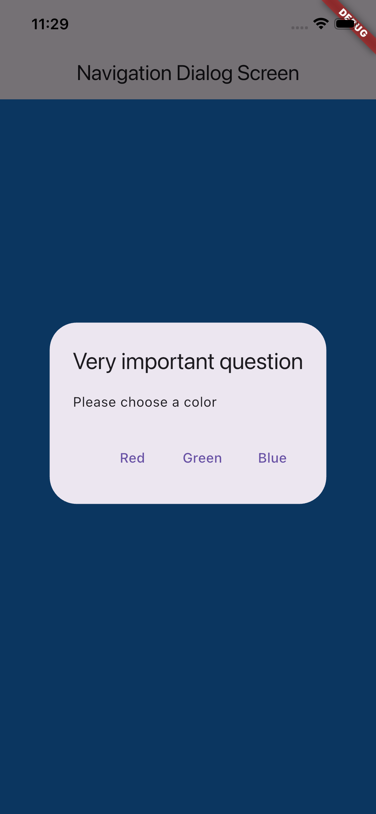

# Week 11
## Practicum 1 : Mengunduh Data dari Web Service (API)

Soal 1
```dart 
Widget build(BuildContext context) {
    return MaterialApp(
      title: 'Flutter Demo - Muhammad Rizal Al Baihaqi',
      debugShowCheckedModeBanner: false,
      theme: ThemeData(
```
Soal 2


Soal 3


------

## Practicum 2 : Menggunakan await/async untuk menghindari callback

Langkah 4 


Soal 4

* **Step 1 (Helper Methods):**
    We define three asynchronous methods: `returnOneAsync`, `returnTwoAsync`, and `returnThreeAsync`. Each method simulates a heavy computational task or network request by using `Future.delayed` for **3 seconds**. After the delay, they return specific integers (1, 2, and 3 respectively).

* **Step 2 (The `count()` Method):**
    The `count()` method orchestrates the execution. It calls the methods from Step 1 sequentially using the `await` keyword. 
    * Because `await` is used line-by-line, the code halts at each line until that specific Future completes.
    * **Process:** It waits 3 seconds for the first number, then *another* 3 seconds for the second, and *another* 3 seconds for the third.
    * **Result:** The total execution time is the sum of all delays ($3 + 3 + 3 = 9$ seconds). Once all futures are resolved, it sums up the values ($1 + 2 + 3 = 6$) and triggers `setState` to update the UI.

## Practicum 3 : Menggunakan Completer di Future

Soal 5 


```dart
late Completer completer;

Future getNumber() {
  completer = Completer<int>();
  calculate();
  return completer.future;
}

Future calculate() async {
  await Future.delayed(const Duration(seconds : 5));
  completer.complete(42);
}
```
Kode tersebut menerapkan konsep **Completer**, yang digunakan untuk membuat dan menyelesaikan `Future` secara manual.

* **`late Completer completer;`**: Mendeklarasikan objek Completer untuk menangani hasil future nanti.
* **`getNumber()`**: Menginisialisasi Completer dan langsung mengembalikan object `completer.future` kepada pemanggil, meskipun hasilnya belum ada (status pending).
* **`calculate()`**: Mensimulasikan proses tunggu selama 5 detik, lalu memanggil `completer.complete(42)`. Perintah inilah yang secara manual "menyelesaikan" Future tersebut dan mengirimkan angka **42** ke pemanggil.

* **Step 2 (Async/Await):**
    In Step 2, we used the `async` and `await` keywords. This approach allows us to write asynchronous code that looks and behaves like synchronous (sequential) code. The program "pauses" at the `await` line until the Future is resolved before moving to the next line. It is generally cleaner and easier to read for sequential tasks.

Soal 6

* **Step 5 & 6 (Then/CatchError):**
    In Steps 5 and 6, we used the **Future API** directly (`.then()` and `.catchError()`).
    * Instead of pausing execution, we explicitly define a "callback" function inside `.then()` that only runs *after* the Future completes successfully.
    * We also explicitly handle exceptions using `.catchError()`, which triggers if the Future fails (e.g., if the `completer.completeError` is called in Step 5).
    * This approach is known as "chaining" and is useful when you want to attach multiple callbacks or handle errors in a specific functional flow without using try-catch blocks.

## Practicum 4 : Memanggil Future Secara Paralel

Soal 7
    

Soal 8 
* **Step 1 (FutureGroup):**
    Uses `FutureGroup` from the `async` package.
    * **Method:** You must `add()` futures one by one and explicitly `close()` the group to signal that no more futures will be added.
    * **Use Case:** It is useful when you don't know exactly how many futures you need upfront or if you need to add them dynamically over time.

* **Step 4 (Future.wait):**
    Uses the standard `Future.wait` from the Dart core library.
    * **Method:** It accepts a `List` of futures directly in the constructor.
    * **Use Case:** It is much cleaner and more concise when you already know exactly which futures you want to execute at the start.

**Similarity:** Both methods execute the futures **in parallel** (simultaneously), not sequentially. This is why the operation takes only 3 seconds (the duration of the longest single task) instead of 9 seconds.

# Practicum 5 : Menangani Respon Error pada Async Code

Soal 9 


Soal 10

- What happens when you call handleError() from the button:
  - Press GO → wait ~2s → UI shows the exception text (e.g. "Exception: Something terrible happened") → console prints "Complete".

- Difference (short):
  - await / try-catch: sequential, easy to read:
    try { await myFuture(); } catch (e) { /* handle */ }
  - then / catchError / whenComplete: callback chaining:
    myFuture().then(...).catchError(...).whenComplete(...)

## Practicum 6 : Menggunakan Future dengan StatefulWidget


## Practicum 7 : Manajemen Future dengan FutureBuilder


## Practicum 8 : Navigation Route dengan Future Function





## Practicum 9 : Memanfaatkan async/await dengan Widget Dialog



**Soal 14**

**Apa yang terjadi saat klik setiap button?**

Ketika tombol **"Change Color"** diklik:
1. Dialog muncul dengan 3 pilihan warna: Red, Green, dan Blue
2. User harus memilih salah satu (barrierDismissible: false → dialog tidak bisa ditutup dengan tap di luar)
3. Setelah memilih warna (misalnya Red):
   - `Navigator.pop(context, color)` mengembalikan warna yang dipilih ke method `_showColorDialog`
   - `await showDialog(...)` menerima hasil (Color) dari pop
   - `setState(() {})` dipanggil untuk memperbarui UI
   - Background Scaffold berubah sesuai warna yang dipilih

**Mengapa demikian?**

* **`await showDialog(...)`** membuat eksekusi berhenti sampai user menutup dialog (dengan memilih warna).
* **`Navigator.pop(context, color)`** mengirim data warna kembali ke pemanggil (sebagai return value dari showDialog).
* **`setState(() {})`** setelah await memastikan variable `color` yang sudah diubah langsung memicu rebuild widget → background langsung berubah.
* **`barrierDismissible: false`** memaksa user memilih salah satu button (tidak bisa dismiss dengan tap outside).

**Perbedaan dengan Practicum 8 (Navigation):**
- Practicum 8: navigasi ke halaman baru (push/pop antar screen)
- Practicum 9: tampilkan dialog di atas screen yang sama (overlay), lebih ringan dan cocok untuk pilihan sederhana