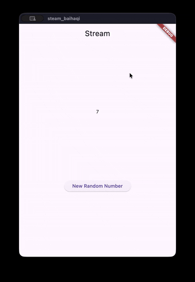
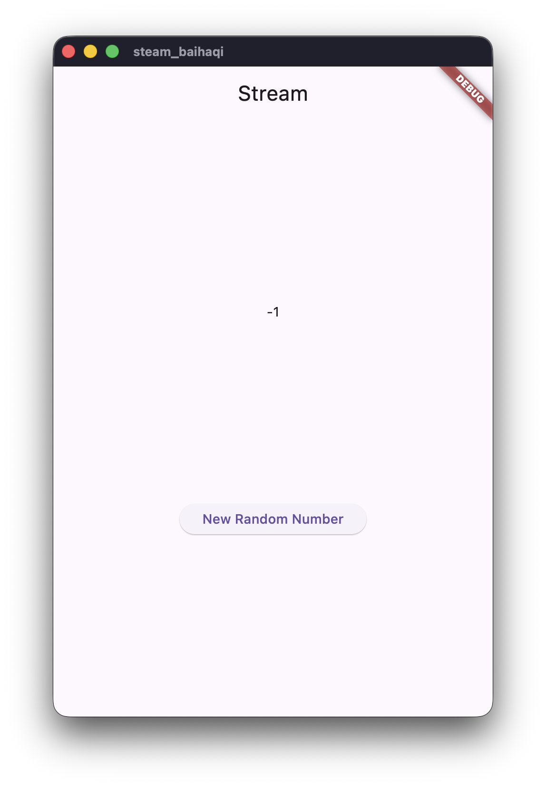
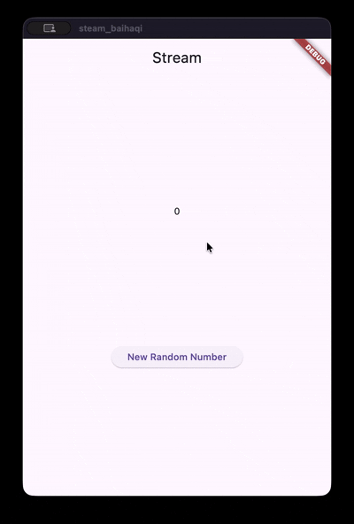
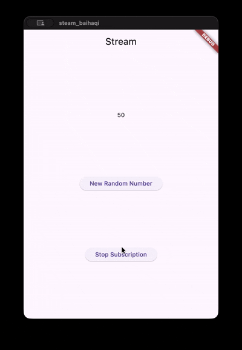
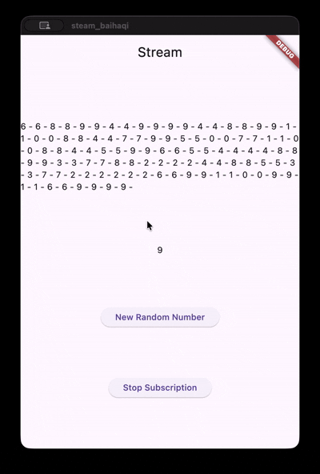
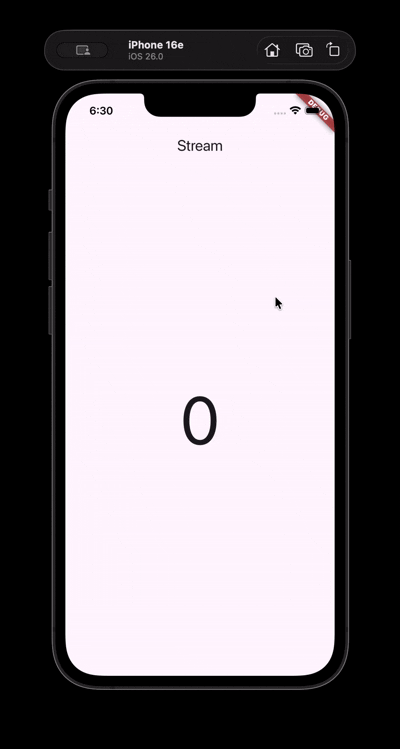
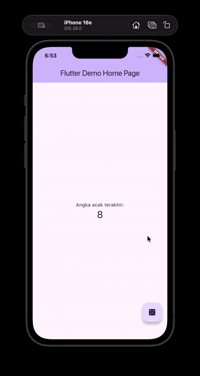

# Week 12

**Nama:** Muhammad Rizal Al Baihaqi

**NIM:** 2341720225

**Kelas:** TI - 3I

---

## Question 3

### 1. Explain the function of the `yield*` keyword!
The `yield*` keyword is used to **pass the job** to another Stream.

Usually, `yield` gives one value at a time. But here, `yield*` tells our function: "Don't create the values yourself. Just take all the values coming from `Stream.periodic` and output them." It acts like a bridge connecting the periodic timer to our app.

### 2. What is the meaning of the code command?
This code creates a stream of colors that changes every second. Here is how it works step-by-step:

* **`Stream.periodic`**: This acts like a timer that ticks every **1 second**.
* **`(int t)`**: This is a counter. It starts at 0 and goes up every second (0, 1, 2, 3...).
* **`int index = t % colors.length`**: This is a math trick to loop the list.
    * It makes sure the number never goes outside the list of colors.
    * If we reach the last color, this math makes it go back to the first color (index 0).
* **`return colors[index]`**: It picks the color from the list and sends it to the screen.

## Question 4

## Question 5

### Explain the difference between `listen` and `await for`!

The main difference is how they handle the code flow:

1.  **`await for`**:
    * It acts like a loop.
    * The code **waits** for each piece of data to arrive before processing the next one. The function stays inside this loop until the stream is finished.

2.  **`listen`**:
    * It acts like a subscription.
    * The code **does not wait**. It sets up a listener and immediately moves to the next line of code.
    * It is more flexible because it gives us a `Subscription` object, allowing us to pause or cancel the stream whenever we want.

## Question 6

### 1. Explain the purpose of the code in steps 8 and 10!

**Step 8 (`initState`):**
This code is responsible for initializing the stream and **listening** to it.
* **`stream.listen`**: This function keeps watching the stream. Whenever new data arrives, this function triggers.
* **`setState`**: Inside the listener, this updates the `lastNumber` variable with the new data and tells Flutter to rebuild the UI so the new number shows up on the screen.

**Step 10 (`addRandomNumber`):**
This function acts as the **data source** that sends numbers into the stream.
* **`Random()`**: It generates a random integer number (from 0 to 9).
* **`addNumberToSink`**: It pushes that random number into the stream's **Sink** (input). From there, the data flows to the listener in Step 8.

## Question 7

### 1. Explain the purpose of the code in steps 13 to 15!

**Step 13 (`addError` method):**
This step creates a specific method to send an **error** into the stream instead of standard data.
* **`controller.sink.addError`**: This command manually throws an error into the stream sink. It simulates a situation where something goes wrong in the data flow.

**Step 14 (`onError` in `listen`):**
This step adds an **Error Handler** to our subscription.
* **`.onError(...)`**: This tells the listener: "If you receive an error from the stream (instead of a number), run this code."
* **`lastNumber = -1`**: Inside the error handler, we change the value to `-1` to visually indicate to the user that an error has occurred.

**Step 15 (`addRandomNumber` edit):**
This step modifies the button's behavior to test the error system.
* We comment out the code that generates random numbers.
* **`numberStream.addError()`**: Now, when the button is pressed, it calls the method from Step 13 to intentionally send an error to the stream.

### 2. Important Note (Revert Code)
As per the instructions in the image:
1.  Test the app (you should see the number turn into -1).
2.  **Uncomment** the random number code in Step 15 and remove the `addError` call so the app works normally again for the next practical.

## Question 8

### 1. Explain the purpose of the code in steps 1-3!

**Step 1 (Declare Variable):**
We declare a variable named `transformer` of type `StreamTransformer`. This object will be used to modify the data flowing through the stream.

**Step 2 (Initialize Transformer):**
In `initState`, we define what the transformer actually does using `.fromHandlers`:
* **`handleData`**: This is the logic filter. It intercepts the data (the random number), **multiplies it by 10** (`value * 10`), and pushes this new modified value to the sink.
* **`handleError`**: If an error occurs, it sends `-1` to the sink.
* **`handleDone`**: closes the sink when the stream is finished.

**Step 3 (Apply Transformer):**
Here we connect the transformer to our original stream using `stream.transform(transformer)`.
* Before this step, the listener received the raw random number (0-9).
* **Now**, the stream passes through the transformer first. So, the listener receives the **multiplied number** (0, 10, 20... 90) and updates the UI with this new value.

## Question 9

### 1. Explain the purpose of the code in steps 2, 6, and 8!

**Step 2 (`initState` edit):**
In this step, we initialize the stream monitoring.
* **`subscription = stream.listen(...)`**: Unlike before, we now store the listener "connection" into a variable named `subscription`.
* This is important because by saving it into a variable, we can control it later (for example, to pause or stop the stream manually).

**Step 6 (`dispose` edit):**
This code is essential for **memory management**.
* **`subscription.cancel()`**: When the screen (widget) is closed or destroyed, this command cancels the subscription.
* It stops the app from listening to the stream in the background, preventing "memory leaks" (wasting the phone's memory).

**Step 8 (`addRandomNumber` edit):**
This step adds a **safety check** before sending data.
* **`if (!numberStreamController.isClosed)`**: It checks, "Is the stream connection still open?"
* **If Yes**: It adds the random number to the stream.
* **If No** (Else): It sets the number to `-1`. This prevents the app from crashing if we try to add data to a stream that has already been stopped.

## Question 10

### Explain why this error happens?

The error "Bad state: Stream has already been listened to" happens because of the type of Stream you are using.

1.  **Single-Subscription Stream:**
    By default, Dart streams are "Single-Subscription". This means they allow **only one listener** at a time. You cannot attach multiple listeners to them.

2.  **The Conflict:**
    In the code, you already defined `subscription` to listen to the stream. When you tried to add `subscription2` to listen to the exact same stream, the stream complained because it was already "busy" with the first listener.

3.  **Analogy:**
    Think of it like a normal phone call. Only one person can pick up the phone. If a second person tries to pick up the same line, it won't work (unless you specifically turn on "Speakerphone" mode, which in Flutter is called a **Broadcast Stream**).

## Question 11

### 1. Explain why this happens?

This happens because you converted the stream into a **Broadcast Stream**.

1.  **Broadcast Stream:**
    By using the code `.asBroadcastStream()`, you changed the stream type. Unlike the standard single-subscription stream (which crashed in Question 10), a Broadcast Stream allows **multiple listeners** at the same time.

2.  **Multiple Listeners Active:**
    Since your code sets up two listeners (`subscription` and `subscription2`) in the `initState`, both of them are now successfully listening to the stream.

3.  **Double Output:**
    When you press the button to add a number (e.g., "4"), **both** listeners receive that number. Both listeners then execute the code to update the text. As a result, the number is appended to the screen twice (appearing as "4-4"), once for each listener.

## Question 12

### 1. Explain the purpose of the code in steps 3 and 7!

**Step 3 (`getNumbers` in `stream.dart`):**
This step defines the **source** of our data stream.
* **`Stream.periodic`**: It creates a stream that emits events repeatedly, like a clock ticking every 1 second.
* **`yield*`**: It outputs the stream of random integers (0-9) generated inside the periodic timer. Essentially, this method creates a factory that produces a new random number every second.

**Step 7 (`StreamBuilder` in `main.dart`):**
This step introduces a very powerful widget called **`StreamBuilder`**.
* **Automation**: Unlike the previous steps where we had to manually use `.listen()` and `setState()`, `StreamBuilder` handles everything automatically. It subscribes to the stream and automatically rebuilds the UI whenever new data arrives.
* **`snapshot`**: This variable holds the latest data from the stream. We check `snapshot.hasData` to see if the number is ready to be displayed.
* **Efficiency**: This makes the code cleaner because we don't need to manually manage the subscription or dispose of it; the widget does it for us.

## Question 13

### 1. Explain the purpose of this practical exercise! Where is the BLoC pattern concept located?

**Purpose of the exercise:**
The goal of this practical is to introduce the **BLoC (Business Logic Component) Pattern**.
* It teaches you how to **separate** the app's logic (the "Brain") from the UI (the "Face").
* Instead of writing logic inside the widget (like inside `setState`), we move it to a separate class (`RandomNumberBloc`).

**Where is the BLoC Concept located?**
The BLoC pattern is implemented in the `RandomNumberBloc` class. Here is the breakdown:
1.  **Input (Sink):** We have `_generateRandomController`. This acts as the **Input**. The UI sends an event here (via the floating button) to say "Hey, I need a number!".
2.  **Logic (Processing):** Inside the `constructor`, the code listens to the input. When it hears a request, it calculates a random number.
3.  **Output (Stream):** We have `_randomNumberController`. This acts as the **Output**. Once the logic calculates the number, it sends it out through this stream so the UI can display it.

**In summary:** The UI only knows about "Inputs" and "Outputs". It doesn't know *how* the number is calculated, which makes the code cleaner and easier to manage.

