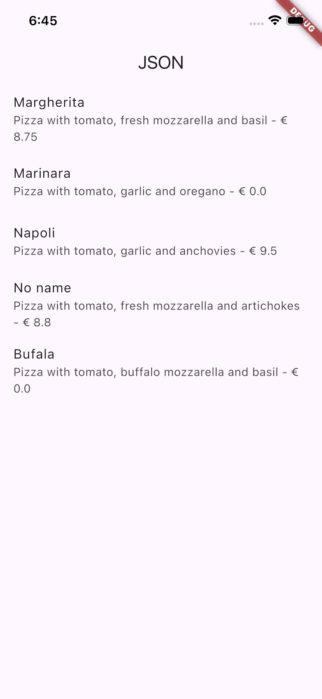
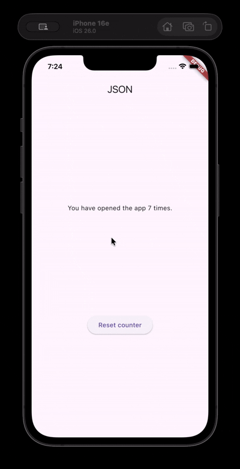
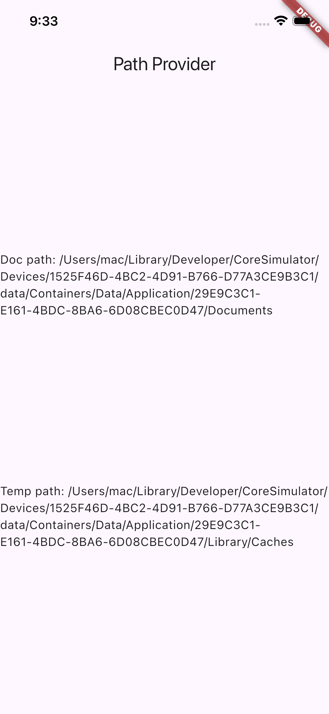
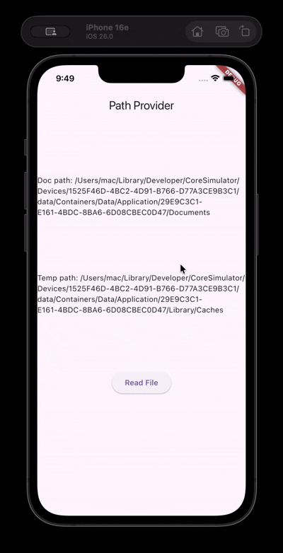

# Practical Report: Week 13 - JSON & Storage

**Name:** Muhammad Rizal Al Baihaqi  
**NIM:** 2341720225  
**Class:** TI-3I (Absen 16)

---

## Question 2
**Description:**
* Created a new file `assets/pizzalist.json` containing the pizza data.
* Registered the assets folder in `pubspec.yaml`.
* Implemented the `readJsonFile` method to load the JSON file as a String and displayed it raw in the UI.

*Result Capture:*

---

## Question 3

---

## Question 4

---

## Question 5
**Explain the meaning of "safer and maintainable" code!**

Refactoring the code to use **Constants** (e.g., `const keyId = 'id'`) instead of **String Literals** makes the application:

1.  **Safer (Less Error-Prone):**
    * Using raw strings like `'pizzaName'` repeatedly increases the risk of **typos** (e.g., typing `'pizaName'`). This would cause the app to fail silently or return null values.
    * With constants, the compiler will verify the variable name. If we misspell the variable `keyName`, the code won't run, allowing us to catch errors early.

2.  **More Maintainable:**
    * If the JSON key from the server/API changes (e.g., from `'pizzaName'` to `'name'`), we only need to update the code in **one place** (the constant declaration).
    * We don't need to hunt down and replace every string occurrence throughout the entire project.

---

## Question 6

---

## Question 7

---

## Question 8
**1. Explain the purpose of the code in steps 3 and 7!**

* **Step 3 (`writeFile`):**
    * This method utilizes the `path_provider` and `dart:io` libraries.
    * It locates the device's local document directory and asynchronously **writes** a text file named `pizzas.txt`.
    * The content written is my specific identity (Name and NIM).

* **Step 7 (`build` & `readFile`):**
    * This step connects the logic to the UI.
    * When the "Read File" button is pressed, it triggers the `readFile` method.
    * `readFile` opens the saved `pizzas.txt`, reads the content as a String, and uses `setState` to update the `fileText` variable, causing the UI to rebuild and display the saved Name and NIM.

*Result Capture:*

---

## Question 9

---